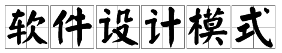

# Design-patterns

设计模式（Design pattern）代表了最佳的实践，通常被有经验的面向对象的软件开发人员所采用。设计模式是软件开发人员在软件开发过程中面临的一般问题的解决方案。这些解决方案是众多软件开发人员经过相当长的一段时间的试验和错误总结出来的。

设计模式是一套被反复使用的、多数人知晓的、经过分类编目的、代码设计经验的总结。使用设计模式是为了重用代码、让代码更容易被他人理解、保证代码可靠性。 毫无疑问，设计模式于己于他人于系统都是多赢的，设计模式使代码编制真正工程化，设计模式是软件工程的基石，如同大厦的一块块砖石一样。项目中合理地运用设计模式可以完美地解决很多问题，每种模式在现实中都有相应的原理来与之对应，每种模式都描述了一个在我们周围不断重复发生的问题，以及该问题的核心解决方案，这也是设计模式能被广泛应用的原因。

总结起来，模式就是经验，设计模式就是设计经验，有了这些经验，我们就能在特定情况下使用特定的设计、组合设计，这样可以大大节省我们的设计时间，提高工作效率。

## 设计模式类型

<table>
  <thead>
    <tr>
      <th style="text-align:left">&#x5E8F;&#x53F7;</th>
      <th style="text-align:center">&#x6A21;&#x5F0F; &amp; &#x63CF;&#x8FF0;</th>
      <th style="text-align:center">&#x5305;&#x62EC;</th>
    </tr>
  </thead>
  <tbody>
    <tr>
      <td style="text-align:left">1</td>
      <td style="text-align:center">
        
<b>&#x521B;&#x5EFA;&#x578B;&#x6A21;&#x5F0F;</b>
           &#x8FD9;&#x4E9B;&#x8BBE;&#x8BA1;&#x6A21;&#x5F0F;&#x63D0;&#x4F9B;&#x4E86;&#x4E00;&#x79CD;&#x5728;

        
&#x521B;&#x5EFA;&#x5BF9;&#x8C61;&#x7684;&#x540C;&#x65F6;&#x9690;&#x85CF;&#x521B;&#x5EFA;&#x903B;

        
&#x8F91;&#x7684;&#x65B9;&#x5F0F;&#xFF0C;&#x800C;&#x4E0D;&#x662F;&#x4F7F;&#x7528;
          new

        
&#x8FD0;&#x7B97;&#x7B26;&#x76F4;&#x63A5;&#x5B9E;&#x4F8B;&#x5316;&#x5BF9;&#x8C61;&#x3002;&#x8FD9;

        
&#x4F7F;&#x5F97;&#x7A0B;&#x5E8F;&#x5728;&#x5224;&#x65AD;&#x9488;&#x5BF9;&#x67D0;&#x4E2A;&#x7ED9;

        
&#x5B9A;&#x5B9E;&#x4F8B;&#x9700;&#x8981;&#x521B;&#x5EFA;&#x54EA;&#x4E9B;&#x5BF9;&#x8C61;&#x65F6;&#x66F4;&#x52A0;&#x7075;&#x6D3B;&#x3002;

      </td>
      <td style="text-align:center">
        <ul>
          <li>&#x5DE5;&#x5382;&#x6A21;&#x5F0F;&#xFF08;Factory Pattern&#xFF09;</li>
          <li>&#x62BD;&#x8C61;&#x5DE5;&#x5382;&#x6A21;&#x5F0F;&#xFF08;Abstract Factory
            Pattern&#xFF09;</li>
          <li>&#x5355;&#x4F8B;&#x6A21;&#x5F0F;&#xFF08;Singleton Pattern&#xFF09;</li>
          <li>&#x5EFA;&#x9020;&#x8005;&#x6A21;&#x5F0F;&#xFF08;Builder Pattern&#xFF09;</li>
          <li>&#x539F;&#x578B;&#x6A21;&#x5F0F;&#xFF08;Prototype Pattern&#xFF09;</li>
        </ul>
      </td>
    </tr>
    <tr>
      <td style="text-align:left">2</td>
      <td style="text-align:center">
        
<b>&#x7ED3;&#x6784;&#x578B;&#x6A21;&#x5F0F;</b>
           &#x8FD9;&#x4E9B;&#x8BBE;&#x8BA1;&#x6A21;&#x5F0F;&#x5173;&#x6CE8;&#x7C7B;&#x548C;

        
&#x5BF9;&#x8C61;&#x7684;&#x7EC4;&#x5408;&#x3002;&#x7EE7;&#x627F;&#x7684;&#x6982;

        
&#x5FF5;&#x88AB;&#x7528;&#x6765;&#x7EC4;&#x5408;&#x63A5;&#x53E3;&#x548C;&#x5B9A;

        
&#x4E49;&#x7EC4;&#x5408;&#x5BF9;&#x8C61;&#x83B7;&#x5F97;&#x65B0;&#x529F;&#x80FD;&#x7684;&#x65B9;&#x5F0F;&#x3002;

      </td>
      <td style="text-align:center">
        <ul>
          <li>&#x9002;&#x914D;&#x5668;&#x6A21;&#x5F0F;&#xFF08;Adapter Pattern&#xFF09;</li>
          <li>&#x6865;&#x63A5;&#x6A21;&#x5F0F;&#xFF08;Bridge Pattern&#xFF09;</li>
          <li>&#x8FC7;&#x6EE4;&#x5668;&#x6A21;&#x5F0F;&#xFF08;Filter&#x3001;Criteria
            Pattern&#xFF09;</li>
          <li>&#x7EC4;&#x5408;&#x6A21;&#x5F0F;&#xFF08;Composite Pattern&#xFF09;</li>
          <li>&#x88C5;&#x9970;&#x5668;&#x6A21;&#x5F0F;&#xFF08;Decorator Pattern&#xFF09;</li>
          <li>&#x5916;&#x89C2;&#x6A21;&#x5F0F;&#xFF08;Facade Pattern&#xFF09;</li>
          <li>&#x4EAB;&#x5143;&#x6A21;&#x5F0F;&#xFF08;Flyweight Pattern&#xFF09;</li>
          <li>&#x4EE3;&#x7406;&#x6A21;&#x5F0F;&#xFF08;Proxy Pattern&#xFF09;</li>
        </ul>
      </td>
    </tr>
    <tr>
      <td style="text-align:left">3</td>
      <td style="text-align:center">
        
<b>&#x884C;&#x4E3A;&#x578B;&#x6A21;&#x5F0F;</b>
           &#x8FD9;&#x4E9B;&#x8BBE;&#x8BA1;&#x6A21;&#x5F0F;&#x7279;&#x522B;

        
&#x5173;&#x6CE8;&#x5BF9;&#x8C61;&#x4E4B;&#x95F4;&#x7684;&#x901A;&#x4FE1;&#x3002;

      </td>
      <td style="text-align:center">
        <ul>
          <li>&#x8D23;&#x4EFB;&#x94FE;&#x6A21;&#x5F0F;&#xFF08;Chain of Responsibility
            Pattern&#xFF09;</li>
          <li>&#x547D;&#x4EE4;&#x6A21;&#x5F0F;&#xFF08;Command Pattern&#xFF09;</li>
          <li>&#x89E3;&#x91CA;&#x5668;&#x6A21;&#x5F0F;&#xFF08;Interpreter Pattern&#xFF09;</li>
          <li>&#x8FED;&#x4EE3;&#x5668;&#x6A21;&#x5F0F;&#xFF08;Iterator Pattern&#xFF09;</li>
          <li>&#x4E2D;&#x4ECB;&#x8005;&#x6A21;&#x5F0F;&#xFF08;Mediator Pattern&#xFF09;</li>
          <li>&#x5907;&#x5FD8;&#x5F55;&#x6A21;&#x5F0F;&#xFF08;Memento Pattern&#xFF09;</li>
          <li>&#x89C2;&#x5BDF;&#x8005;&#x6A21;&#x5F0F;&#xFF08;Observer Pattern&#xFF09;</li>
          <li>&#x72B6;&#x6001;&#x6A21;&#x5F0F;&#xFF08;State Pattern&#xFF09;</li>
          <li>&#x7A7A;&#x5BF9;&#x8C61;&#x6A21;&#x5F0F;&#xFF08;Null Object Pattern&#xFF09;</li>
          <li>&#x7B56;&#x7565;&#x6A21;&#x5F0F;&#xFF08;Strategy Pattern&#xFF09;</li>
          <li>&#x6A21;&#x677F;&#x6A21;&#x5F0F;&#xFF08;Template Pattern&#xFF09;</li>
          <li>&#x8BBF;&#x95EE;&#x8005;&#x6A21;&#x5F0F;&#xFF08;Visitor Pattern&#xFF09;</li>
        </ul>
      </td>
    </tr>
    <tr>
      <td style="text-align:left">4</td>
      <td style="text-align:center">
        
<b>J2EE &#x6A21;&#x5F0F;</b>
           &#x8FD9;&#x4E9B;&#x8BBE;&#x8BA1;&#x6A21;&#x5F0F;&#x7279;&#x522B;&#x5173;&#x6CE8;&#x8868;

        
&#x793A;&#x5C42;&#x3002;&#x8FD9;&#x4E9B;&#x6A21;&#x5F0F;&#x662F;&#x7531;
          Sun Java Center &#x9274;&#x5B9A;&#x7684;&#x3002;

      </td>
      <td style="text-align:center">
        <ul>
          <li>MVC &#x6A21;&#x5F0F;&#xFF08;MVC Pattern&#xFF09;</li>
          <li>&#x4E1A;&#x52A1;&#x4EE3;&#x8868;&#x6A21;&#x5F0F;&#xFF08;Business Delegate
            Pattern&#xFF09;</li>
          <li>&#x7EC4;&#x5408;&#x5B9E;&#x4F53;&#x6A21;&#x5F0F;&#xFF08;Composite Entity
            Pattern&#xFF09;</li>
          <li>&#x6570;&#x636E;&#x8BBF;&#x95EE;&#x5BF9;&#x8C61;&#x6A21;&#x5F0F;&#xFF08;Data
            Access Object Pattern&#xFF09;</li>
          <li>&#x524D;&#x7AEF;&#x63A7;&#x5236;&#x5668;&#x6A21;&#x5F0F;&#xFF08;Front
            Controller Pattern&#xFF09;</li>
          <li>&#x62E6;&#x622A;&#x8FC7;&#x6EE4;&#x5668;&#x6A21;&#x5F0F;&#xFF08;Intercepting
            Filter Pattern&#xFF09;</li>
          <li>&#x670D;&#x52A1;&#x5B9A;&#x4F4D;&#x5668;&#x6A21;&#x5F0F;&#xFF08;Service
            Locator Pattern&#xFF09;</li>
          <li>&#x4F20;&#x8F93;&#x5BF9;&#x8C61;&#x6A21;&#x5F0F;&#xFF08;Transfer Object
            Pattern&#xFF09;</li>
        </ul>
      </td>
    </tr>
  </tbody>
</table>

